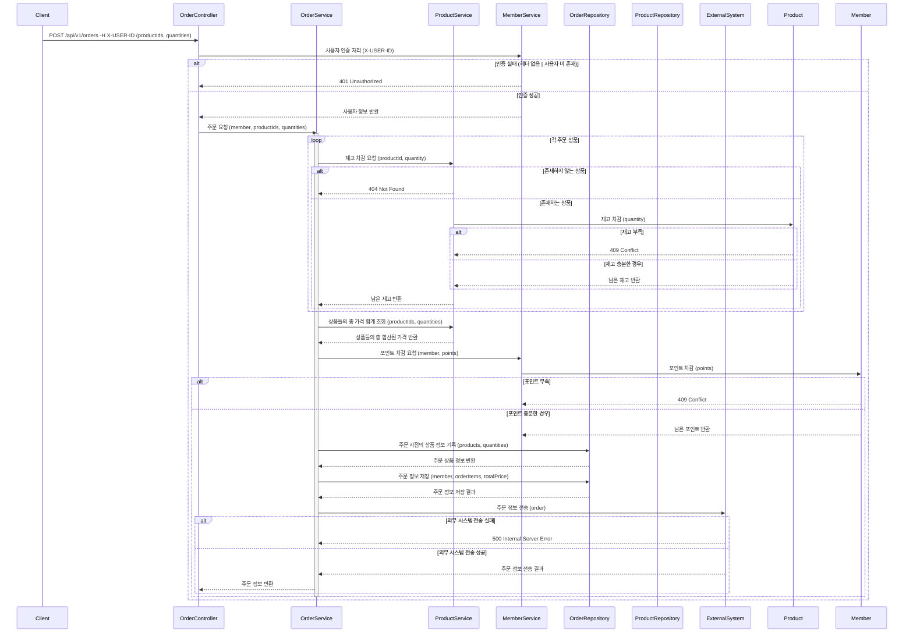

# Sequence Diagrams

## 브랜드 & 상품

### 상품 목록 조회

GET /api/v1/products?brandId={brandId}&sort={sort}&page={page}&size={size}

### 브랜드 정보 조회

GET /api/v1/brands/{brandId}

### 상품 상세 정보 조회

GET /api/v1/products/{productId}

## 좋아요 (Likes)

### 상품 좋아요 등록

POST /api/v1/products/{productId}/likes

### 상품 좋아요 취소

DELETE /api/v1/products/{productId}/likes

### 내가 좋아요 한 상품 목록

GET /api/v1/users/{userId}/likes?page={page}&size={size}

## 주문 및 결제

### 주문 요청

POST /api/v1/orders

### 유저의 주문 목록 조회

GET /api/v1/users/{userId}/orders

### 단일 주문 상세 조회

GET /api/v1/orders/{orderId}

