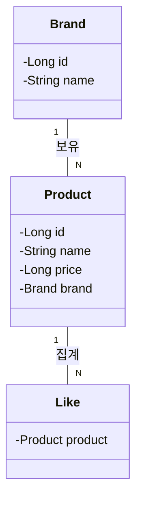
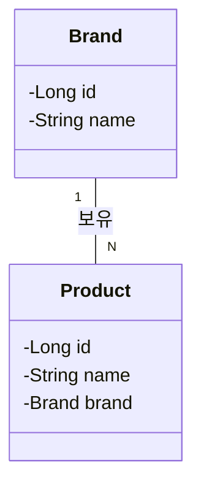
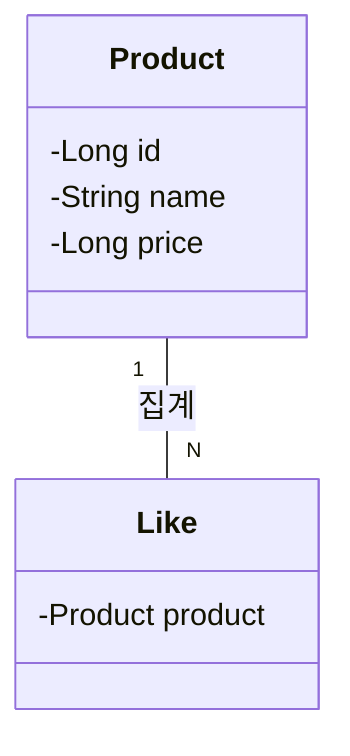
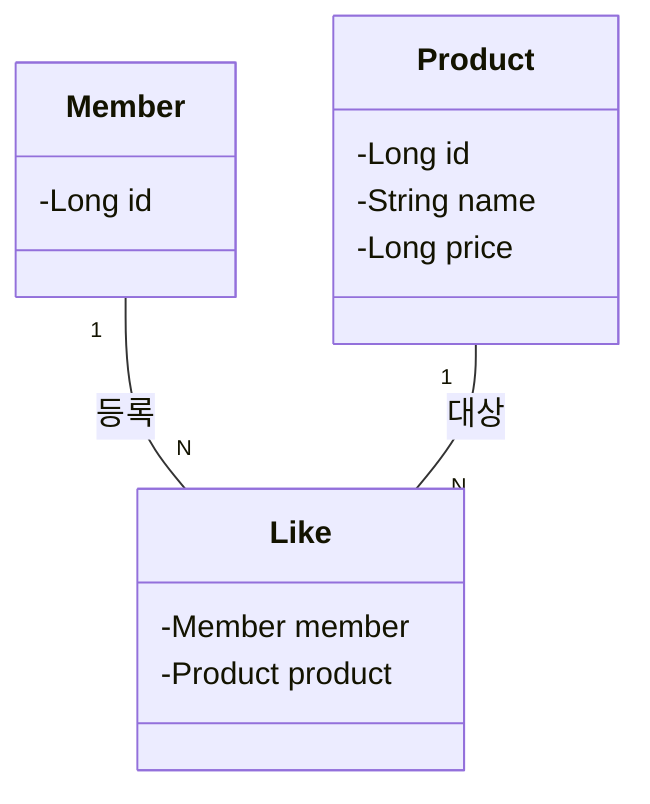
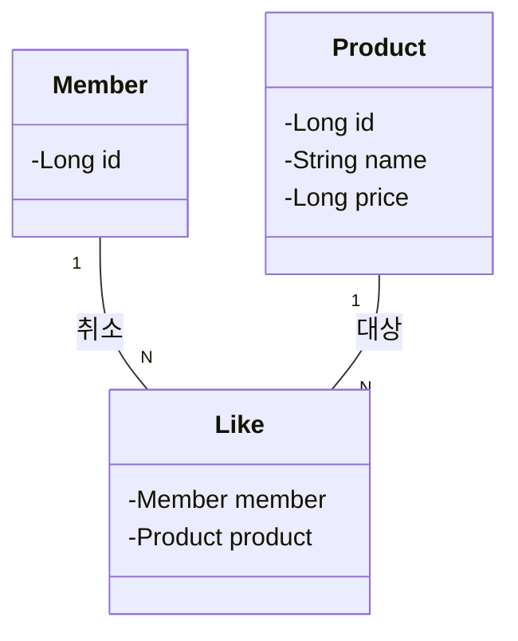
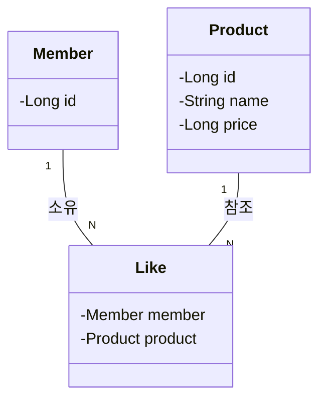
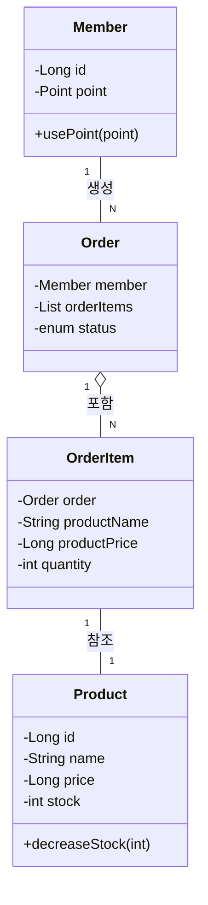
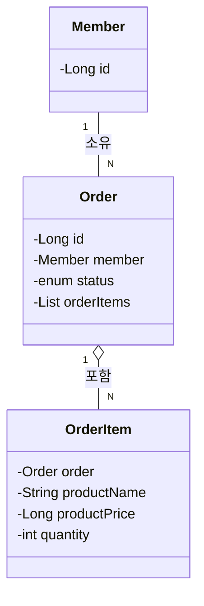
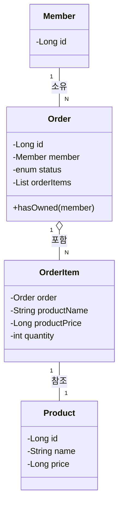

# Class Diagrams

## 브랜드 & 상품

### 상품 목록 조회

### 브랜드 정보 조회

### 상품 상세 정보 조회

## 좋아요 (Likes)

### 상품 좋아요 등록

### 상품 좋아요 취소

### 내가 좋아요 한 상품 목록 조회

## 주문 및 결제

### 주문 요청

### 유저의 주문 목록 조회

### 단일 주문 상세 조회

