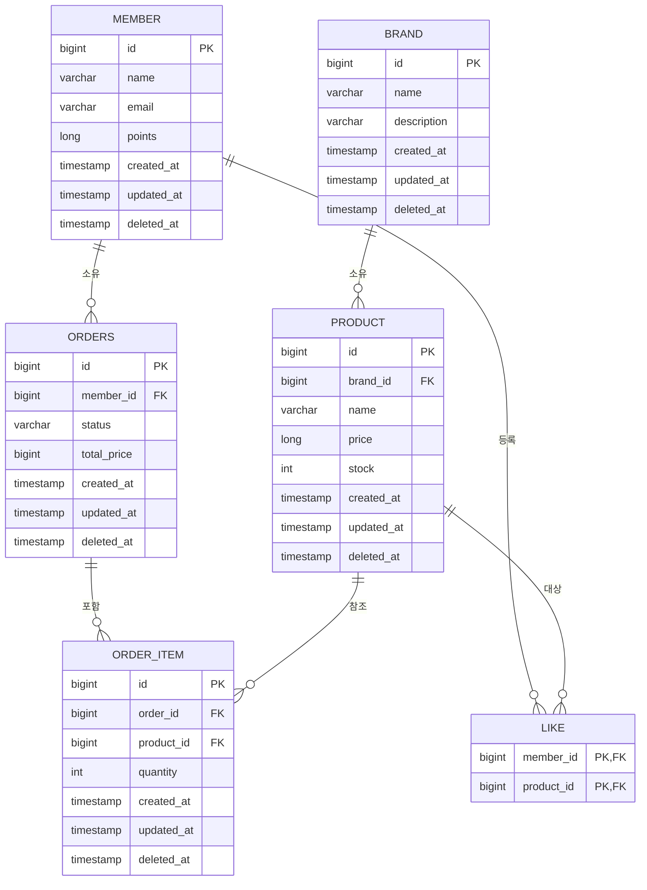

# ERD

```mermaid

erDiagram
    MEMBER {
        bigint id PK 
        varchar name 
        varchar email
        long points 
        timestamp created_at
        timestamp updated_at
        timestamp deleted_at
    }

    BRAND {
        bigint id PK 
        varchar name 
        varchar description
        timestamp created_at
        timestamp updated_at
        timestamp deleted_at
    }

    PRODUCT {
        bigint id PK 
        bigint brand_id FK 
        varchar name 
        long price 
        int stock 
        timestamp created_at
        timestamp updated_at
        timestamp deleted_at
    }

    LIKE {
        bigint member_id PK, FK 
        bigint product_id PK, FK 
    }

    ORDERS {
        bigint id PK 
        bigint member_id FK 
        %% -- enum : NOT_PAID, PAID, CANCELLED
        varchar status 
        bigint total_price
        timestamp created_at
        timestamp updated_at
        timestamp deleted_at
    }

    ORDER_ITEM {
        bigint id PK 
        bigint order_id FK 
        bigint product_id FK 
        int quantity
        timestamp created_at
        timestamp updated_at
        timestamp deleted_at
    }

    MEMBER ||--o{ ORDERS : 소유
    MEMBER ||--o{ LIKE : 등록
    PRODUCT ||--o{ LIKE : 대상
    BRAND ||--o{ PRODUCT : 소유
    ORDERS ||--o{ ORDER_ITEM : 포함
    PRODUCT ||--o{ ORDER_ITEM : 참조

```